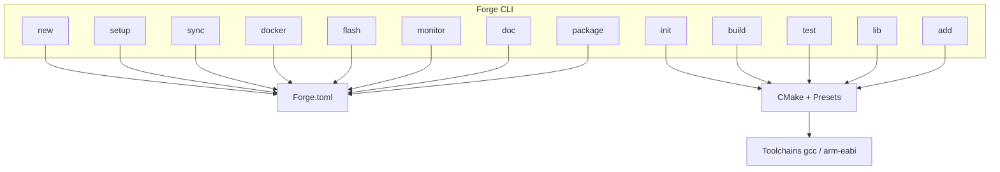
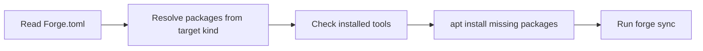
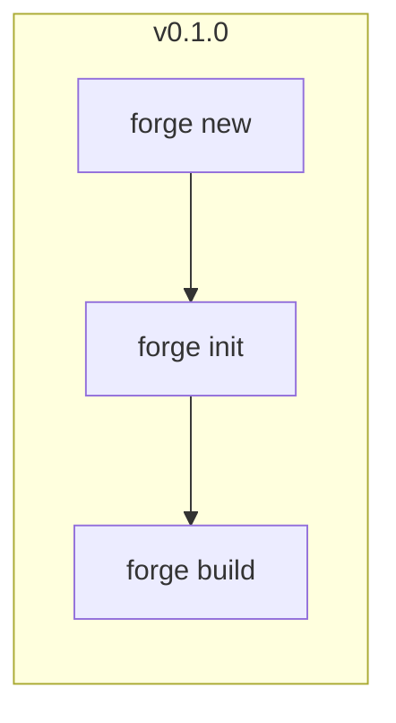

# Forge Development Roadmap

Forge is a Go CLI for embedded C/C++ projects built on **CMake**, **CMake presets**, and cross-compilation toolchains. Development proceeds from the current prototype through incremental releases to **v1.0.0**.

## Vision

**Phase 1 (v0.2.0–v0.6.0):** STM32 bare-metal and host Linux on a Linux development host.

**v1.0.0:** Stable release supporting host Linux and STM32 cross-build — with `forge setup`, Docker, CMake library targets, and the full v1 command set.

**v2.0.0 (future):** Embedded Linux targets (Raspberry Pi, `gcc-arm-linux-gnueabihf`).

## v1.0.0 target

| Area | Requirement |
|------|-------------|
| **Targets** | Host Linux (`gcc`), STM32 bare-metal (`gcc-arm-none-eabi`) |
| **Build base** | CMake + CMakePresets + CMake library targets |
| **Reproducibility** | Docker dev environment generation |
| **Commands** | `new`, `init`, `setup`, `sync`, `docker`, `build`, `doc`, `flash`, `monitor`, `test`, `lib`, `add`, `package` |

Example end-state workflow:

```bash
forge new blink stm32f103r8
cd blink
forge init
forge setup    # install missing toolchains + host tools
forge sync     # detect paths, write into Forge.toml
forge build
forge flash
forge monitor
```

## Architecture

`Forge.toml` is the single source of truth for project configuration. Commands read or update it; CMake and toolchains are generated from it.



### Planned internal packages

| Package | Purpose |
|---------|---------|
| `internal/config/` | Load, save, and validate `Forge.toml` |
| `internal/devices/` | STM32 board catalog (starting with `stm32f103r8`) |
| `internal/toolchain/` | CMake toolchain file generators (host, arm-eabi) |
| `internal/setup/` | Map `Forge.toml` targets to distro packages; run apt (with `--dry-run` flag) |
| `internal/install/` | Package manifest per target kind (`host`, `stm32`) |
| `internal/templates/` | Target-aware project templates (evolved from `contents/`) |
| `internal/package/` | Download and extract third-party archives (CMSIS) into the user cache |
| `cmd/<command>.go` | One file per CLI command |

## Forge.toml schema

Schema grows across releases. Target shape at v1.0.0:

```toml
[project]
name = "blink"
version = "0.1.0"

[target]
kind = "stm32"          # host | stm32  (arm-linux deferred to v2.0.0)
board = "stm32f103r8"   # device catalog key

[toolchain]
compiler = "gcc-arm-none-eabi"
prefix = "/usr/bin/arm-none-eabi-"

[tools]
cmake = "3.28"
openocd = "0.12.0"
stflash = "1.7.0"

[install]
manager = "apt"         # Linux host package manager (v1.0.0: apt only)
packages = [
  "build-essential",
  "cmake",
  "ninja-build",
  "gcc-arm-none-eabi",
  "openocd",
  "stlink-tools",
]

[flash]
interface = "stlink"
transport = "swd"

[monitor]
port = "/dev/ttyUSB0"
baud = "115200"

[dependencies]
# v1 target shape (table). v0.2.0 writes a top-level array instead:
# dependencies = ["cmsis5@5.9.0"]
```

`[install].packages` is derived from `[target]` and `[tools]` requirements in the device catalog when `forge new` runs. `forge setup` reads this section to install missing dependencies.

## forge setup behavior

`forge setup` bootstraps the host environment for the current project.



| | |
|---|---|
| **Input** | `Forge.toml` in cwd (`[target]`, `[install]`, `[tools]`) |
| **Output** | Installed packages + updated tool paths in `Forge.toml` (via sync) |
| **v1.0.0 host** | Ubuntu/Debian apt only |
| **Flags** | `--dry-run`, `--yes` (non-interactive) |

| Command | Role |
|---------|------|
| `forge setup` | **Install** missing dependencies |
| `forge sync` | **Detect** what is already installed and record paths |

## Command delivery matrix

| Command | Introduced |
|---------|-----------|
| `forge new` | v0.1.0 (enhanced v0.2.0) |
| `forge init` | v0.1.0 (enhanced v0.2.0) |
| `forge build` | v0.1.0 (enhanced v0.3.0) |
| `forge setup` | v0.3.0 |
| `forge sync` | v0.3.0 |
| `forge flash` | v0.4.0 |
| `forge monitor` | v0.4.0 |
| `forge lib` | v0.5.0 |
| `forge add` | v0.5.0 |
| `forge docker` | v0.6.0 |
| `forge test` | v0.6.0 |
| `forge doc` | v1.0.0 |
| `forge package` | v1.0.0 |

---

## v0.1.0 — Prototype (current)

Basic CLI skeleton and generic project scaffolding.

1. **`forge new <name>`** — create project directory and generic `Forge.toml`
2. **`forge init`** — generate starter folders and static templates (`main.c`, `CMakeLists.txt`, `CMakePresets.json`)
3. **`forge build`** — run CMake configure and build in `build/`



Known limitation: `forge init` uses in-memory config and does not read `Forge.toml` from disk. Fixed in v0.2.0.

---

## v0.2.0 — STM32 project bootstrap

**Phase 1 start.** Device-aware project creation for STM32.

1. **`forge new <name> <device>`** — device-aware `Forge.toml` (first board: `stm32f103r8`; e.g. `forge new blink stm32f103r8`)
2. **`forge init`** — read `Forge.toml` from cwd; generate STM32 project tree (linker + CMake; startup `.s` still open); fetch `dependencies` into `~/.cache/forge/packages/` and emit `cmake/Package.cmake`
3. **gcc-arm-none-eabi + CMake preset** — toolchain file and `CMakePresets.json` entries for `stm32-debug` / `stm32-release` (presets still use host-named `debug` / `release`)

---

## v0.3.0 — Host tools, setup, and multi-target build

1. **`forge setup`** — read `Forge.toml`; install missing toolchains and host tools via apt (`build-essential`, `cmake`, `ninja-build`, `gcc-arm-none-eabi`, `openocd`, `stlink-tools` for STM32 projects); support `--dry-run`; re-run `forge sync` after success
2. **`forge sync`** — detect installed tools; write paths and versions into `Forge.toml`
3. **Host Linux + preset-driven `forge build`** — host preset (`host-debug`) and preset selection from `Forge.toml`

---

## v0.4.0 — STM32 on-device workflow

1. **`forge flash`** — flash `.elf`/`.bin` via OpenOCD (ST-Link) with `st-flash` fallback
2. **`forge monitor`** — attach to serial port and stream logs (port/baud from `Forge.toml`)
3. **Flash/monitor defaults per board** — ST-Link + USART defaults for `stm32f103r8` in device catalog

---

## v0.5.0 — Libraries and third-party code

1. **`forge lib <name>`** — scaffold static/shared library (`lib/<name>/CMakeLists.txt`, `include/`, `src/`)
2. **`forge add <package>`** — CLI to add further third-party sources (STM32 HAL, FreeRTOS); CMSIS Core is already fetched on `init` from `dependencies`
3. **CMake library targets** — wire `forge lib` output into root build graph

---

## v0.6.0 — Reproducible builds and testing

1. **`forge docker`** — generate `Dockerfile` and optional `docker-compose.yml` pinned to tool versions from `Forge.toml`
2. **`forge test`** — create `tests/` layout; fetch test framework (Unity + CMock via CMake `FetchContent`)
3. **Complete CMake presets matrix** — unified presets for host/stm32 debug and release

---

## v1.0.0 — First stable release

1. **`forge doc`** — generate Doxygen config and `docs/` scaffold from `Forge.toml` and project sources
2. **`forge package`** — produce Linux host distributable (`.tar.gz` or `.deb`) with requirements manifest
3. **Release polish** — reference example (`blink` on STM32F103R8), updated README, integration smoke tests for all v1 commands

### v1.0.0 checklist

- [ ] Toolchains: `gcc`, `gcc-arm-none-eabi`
- [ ] Infrastructure: Docker, CMake libs, CMake presets, `forge setup`
- [ ] Targets: host Linux, STM32 on Linux host
- [ ] Commands: `new`, `init`, `setup`, `sync`, `docker`, `build`, `doc`, `flash`, `monitor`, `test`, `lib`, `add`, `package`

---

## v2.0.0 — Embedded Linux (future)

Cross-compilation for ARM Linux targets. Deferred from v1.0.0.

1. **gcc-arm-linux-gnueabihf toolchain module** — CMake toolchain file for cross-compiling to ARM Linux
2. **Raspberry Pi target preset** — `target.kind = "arm-linux"`, board profile (e.g. `raspberry-pi-4`)
3. **`forge build` cross-compile path** — build Linux ARM binaries on host Linux using synced toolchain paths

---

## Out of scope for v1.0.0

- Embedded Linux / Raspberry Pi (planned v2.0.0)
- Windows/macOS host support
- Full STM32 family catalog (start with F103, expand post-1.0)
- IDE plugins (VS Code extension)
- Cloud CI templates

These constraints keep v1.0.0 focused on **Linux host + STM32**.
